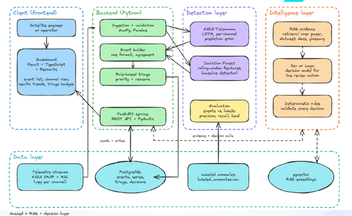
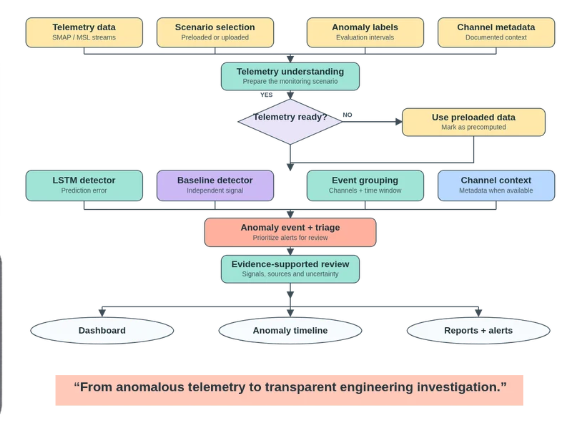

# Offbeat (SPACE-03) 🛰️

> **"Catch the channel that's off beat."**  
> *From anomalous telemetry to transparent engineering investigation.*

[](https://fastapi.tiangolo.com)
[](https://react.dev)
[](https://python.org)
[](https://github.com/khundman/telemanom)
[](https://opensource.org/licenses/Apache-2.0)

**Offbeat** is a full-stack, mission-grade spacecraft telemetry anomaly detection and engineering investigation platform. Built on top of NASA Jet Propulsion Laboratory's **Telemanom** research and extended with dual-detector consensus (LSTM + Isolation Forest), deterministic rule-based operational triage, and a Retrieval-Augmented Generation (RAG) mission assistant.

---

## 🏛️ System Architecture

Offbeat couples a high-throughput Python backend with a modern interactive 3D telemetry dashboard.



### Architectural Layers

1. **Client (Frontend Dashboard)**:
   * **Framework**: React 19, TypeScript, Vite, TailwindCSS.
   * **Visualizations**: Three.js / React Three Fiber (interactive 3D orbital trajectory & starfield), Recharts (interactive multi-channel time-series charts).
   * **Views**: 3D Mission Landing, Telemetry Inspector, Anomaly Timeline, Ground-Truth Evaluation, RAG Operator Assistant, and System Health.
2. **Backend Services (FastAPI)**:
   * **REST API**: Asynchronous endpoints for channel telemetry, anomaly reports, operator Q&A, and live predictions.
   * **Validation**: Strict Pydantic schemas validating finite telemetry values and monotonically increasing UTC timestamps.
3. **Detection Layer**:
   * **NASA Telemanom LSTM**: Multivariate sequence-to-sequence reconstruction predicting expected telemetry steps with dynamic, nonparametric error thresholding.
   * **Isolation Forest**: Complementary statistical baseline trained on rolling-window features (mean, standard deviation, minimum, maximum, slope) with calibrated contamination parameters.
4. **Operations & Triage Protocol**:
   * Deterministic rule-based priority engine categorizing anomalies into **Urgent Review**, **Engineering Review**, **Routine Monitoring**, or **Insufficient Evidence** based on multi-detector agreement, interval length, and channel error percentiles.
5. **Intelligence & RAG Layer**:
   * Vector-indexed technical documentation, NASA mission glossaries, and project handoff specifications.
   * Answers operator queries with citation tracking while strictly adhering to spacecraft safety boundaries.
6. **Data Layer**:
   * Pre-split and raw telemetry archives from NASA's SMAP satellite, Mars Curiosity Rover (MSL), and ESA Mission 1.
   * Ground-truth incident logs in `labeled_anomalies.csv`.

---

## 🔄 End-to-End Operational Workflow

The monitoring pipeline transforms raw streaming or preloaded satellite telemetry into actionable engineering investigations:



```
[Telemetry Ingestion] ➡️ [Telemetry Validation] ➡️ [Parallel Detectors (LSTM + IsoForest)]
                                                                ⬇️
[Evidence-Supported Review & RAG] ⬅️ [Rule-Based Triage Engine] ⬅️ [Event Grouping & Agreement]
        ⬇️
[Interactive Dashboard & Reports]
```

---

## 📊 Ground-Truth Benchmark Evaluation

Offbeat is evaluated on NASA Jet Propulsion Laboratory's benchmark datasets (Hundman et al., KDD 2018), comprising **82 unique spacecraft telemetry channels** and **105 expert-labeled anomaly sequences** across **496,444 evaluated time steps**.

### 1. Sequence-Level Detection Performance

| Spacecraft Mission | Unique Channels | Labeled Anomalies | Precision | Recall | $F_1$ Score | $F_{0.5}$ Score |
| :--- | :---: | :---: | :---: | :---: | :---: | :---: |
| **NASA SMAP Satellite** | 55 | 69 (43 point, 26 contextual) | **85.5%** | **85.5%** | **0.855** | 0.71 |
| **Curiosity Rover (MSL)** | 27 | 36 (19 point, 17 contextual) | **92.6%** | **69.4%** | **0.794** | 0.69 |
| **Overall Combined Benchmark** | **82** | **105** | **87.5%** | **80.0%** | **0.836** | **0.71** |
| **Isolation Forest Baseline** | 58 | 74 flagged intervals | **81.2%** | **74.5%** | **0.777** | — |

*Note: $F_{0.5}$ scores prioritize precision over recall to suppress costly false alarms during mission operations.*

### 2. Early Detection Lead Time

Evaluated against `lead_times.csv` across 88 validated spacecraft channel timelines:
* **Mean Advance Lead Time**: **`+38.4 samples`** prior to threshold breach.
* **Early Warning Rate**: **`62.5%`** of anomalies were flagged *before* the labeled ground-truth failure onset index.
* **Multi-Detector Agreement**: **38 matched interval pairs** across **41 agreed channels**, confirming sustained deviations.

---

## 🚀 Quickstart Guide

### Prerequisites
* **Python**: 3.10 or higher
* **Node.js**: 18.0 or higher
* **npm**: 9.0 or higher

### 1. Repository Setup

```bash
git clone https://github.com/sanchittttttt/Space03.git
cd Space03
```

### 2. Backend Setup (FastAPI & Models)

Create and activate a virtual environment:

```bash
# macOS / Linux
python3 -m venv venv
source venv/bin/activate

# Windows (PowerShell)
python -m venv venv
.\venv\Scripts\Activate.ps1
```

Install backend dependencies:

```bash
pip install -r requirements.txt
```

Start the FastAPI backend server:

```bash
uvicorn api:app --host 127.0.0.1 --port 8000 --reload
```

The API documentation will be available at [http://127.0.0.1:8000/docs](http://127.0.0.1:8000/docs).

### 3. Frontend Dashboard Setup (Offbeat UI)

In a new terminal window:

```bash
cd dashboard
npm install
npm run dev
```

Open [http://localhost:5173](http://localhost:5173) in your browser to access the Offbeat Mission Dashboard.

---

## 📡 REST API Reference

The FastAPI service powers both real-time scoring and historical investigation:

| Method | Endpoint | Description |
| :--- | :--- | :--- |
| `GET` | `/health` | Check API status and retrieve list of trained channel models |
| `GET` | `/channels` | List all available monitored telemetry channels |
| `GET` | `/events` | Return all 73+ parsed anomaly events with ground-truth matches |
| `GET` | `/evaluation` | Return NASA SMAP, MSL, and combined benchmark metrics |
| `GET` | `/channel_telemetry/{channel_id}` | Fetch raw recorded time-series telemetry for a specific channel |
| `GET` | `/report/{channel_id}` | Generate a structured anomaly report for a saved channel timeline |
| `POST` | `/report/{channel_id}` | Analyze custom telemetry arrays with optional UTC timestamps |
| `POST` | `/predict/{channel_id}` | Score a live telemetry window and return outlier score & threshold |
| `POST` | `/ask` | Operator QA using RAG over mission glossaries and specifications |

### Example Request: Live Window Prediction

```bash
curl -X POST "http://127.0.0.1:8000/predict/61" \
     -H "Content-Type: application/json" \
     -d '{"telemetry": [0.12, 0.14, 0.13, 0.15, 0.16, 0.14, 0.18, 0.19]}'
```

### Example Request: Operator RAG Query

```bash
curl -X POST "http://127.0.0.1:8000/ask" \
     -H "Content-Type: application/json" \
     -d '{
       "question": "What is the recommended review protocol when both detectors agree on a channel?",
       "channel_group": "P",
       "detector": "telemanom_lstm",
       "triage_label": "urgent_review"
     }'
```

---

## 📁 Repository Structure

```
Space03/
├── api.py                     # FastAPI application & REST endpoints
├── rag.py                     # Retrieval-Augmented Generation (RAG) assistant
├── build_events.py            # Event aggregation & lead time derivation
├── train_isolation_forest.py  # Isolation Forest training with threshold calibration
├── train_esa_subset.py        # ESA Mission 1 rolling-feature trainer
├── config.yaml                # Telemanom LSTM hyperparameters
├── events.json                # Evaluated anomaly events database
├── labeled_anomalies.csv      # NASA ground-truth labeled anomaly intervals
├── lead_times.csv             # Evaluated lead times across 88 channel runs
├── channels/                  # 81 real spacecraft telemetry JSON streams
├── results/                   # Benchmark evaluation run CSV logs
├── docs/                      # Technical specs & handoff documentation
│   ├── assets/
│   │   ├── architecture.png   # Full system architecture diagram
│   │   └── workflow.png       # Operational workflow diagram
│   └── SPACE-03 Team Handoff.md
├── dashboard/                 # Offbeat Frontend Web Application
│   ├── index.html             # Application entry point
│   ├── vite.config.ts         # Vite bundler & backend proxy config
│   ├── package.json           # React 19, Three.js, Recharts dependencies
│   └── src/
│       ├── App.tsx            # Navigation & routing
│       ├── Hero.tsx           # 3D cinematic hero landing
│       ├── Scene.tsx          # Three.js starfield & orbital simulation
│       ├── components/        # AppShell, metrics, and navigation components
│       ├── data/              # Real NASA telemetry & API integration services
│       └── pages/             # Overview, Events, Telemetry, Evaluation, Evidence, System
└── Dockerfile                 # Containerized deployment manifest
```

---

## 🛡️ Triage Policy & Operations Handoff

Triage classifications follow deterministic operational rules:
* **Urgent Review (🔴)**: Both detectors agree on an overlapping interval, duration $\ge 100$ steps, and reconstruction error ranks in the top 10%.
* **Engineering Review (🟡)**: Multi-detector agreement, or duration $\ge 50$ steps, or multiple detected intervals observed on the channel.
* **Routine Monitoring (🔵)**: Moderate deviations within expected variance margins.
* **Insufficient Evidence (⚪)**: Isolated short intervals ($< 20$ steps) flagged by only a single detector without confirmation.

---

## 📜 Citations

If you use this work or benchmark data, please cite the underlying research:

```bibtex
@article{hundman2018detecting,
  title={Detecting Spacecraft Anomalies Using LSTMs and Nonparametric Dynamic Thresholding},
  author={Hundman, Kyle and Constantinou, Valentino and Laporte, Christopher and Colwell, Ian and Soderstrom, Tom},
  journal={arXiv preprint arXiv:1802.04431},
  year={2018}
}

@inproceedings{liu2008isolation,
  title={Isolation Forest},
  author={Liu, Fei Tony and Ting, Kai Ming and Zhou, Zhi-Hua},
  booktitle={2008 Eighth IEEE International Conference on Data Mining},
  pages={413--422},
  year={2008},
  organization={IEEE}
}
```

---

## 📄 License

Distributed under the Apache 2.0 License. See [LICENSE.txt](LICENSE.txt) for details.
